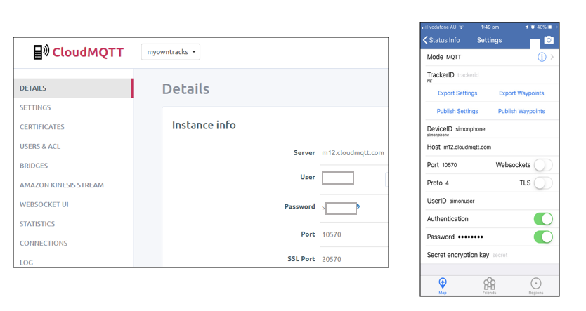

| [Overview](/README.md) | [Phone Setup](/docs/phone.md)  | MQTT Server |[MQTT to Kafka](/docs/mqtt_kafka.md) |
|---|----|----|-----|

Establish an MQTT Server.  I used https://www.cloudmqtt.com/

You'll need to setup
- host
- username & password for each phone to write
- username & password for kafka connect to read
- Access control lists

You'll need these settings also for [MQTT to Kafka](/docs/mqtt_kafka.md)